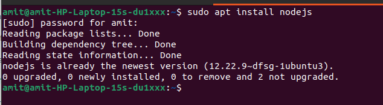
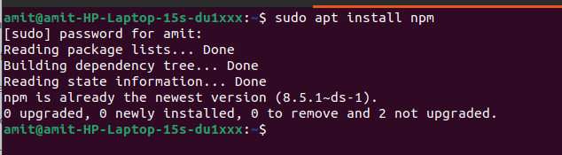
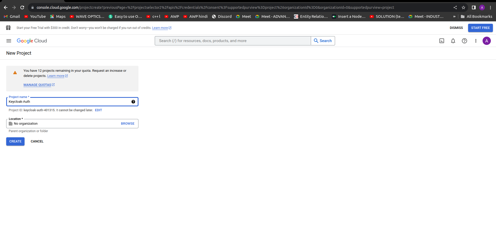
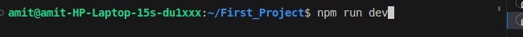

# <u><h1 style="text-align:center">SETUP OF KEYCLOAK </h1></u>


## 1. Task Requirement :  
- Integration of Google Auth with Keycloak as an Identity Provider.

- Creating a login page in Vuejs that will authenticate with Google using Keycloak and the Keycloak Free OTP service.

## 2. Environment Details :
- OS: Ubuntu 22.04.3 LTS

- Podman version: version 3.4.4

-  Nodejs: v12.22.9

-  Npm: 9.7.1

- Jdk: 11.0.20.1

## 3. System Configuration :

- Processor: CORE intel i5
- Generation: 10TH GEN

- CPU: 8 Core
- SSD: 512GB
- HDD: 1TB

## 4. Tools and Technologies :
- Keycloak: 21.1.1
- Google Cloud Platform Url: [ https://console.cloud.google.com/apis/library ]
- Vuejs:  3.3.4


##   Definition of Tools :

* **Ubuntu 22.04.3 LTS:** It is a stable, long-term support version of the Ubuntu Linux operating system.

* **Podman 3.4.4:** It is a containerization tool for managing and running containers on Linux systems.

* **Keycloak :** It is an open-source software solution designed to provide single-sign-on access to applications and services. It allows users to authenticate once and access multiple applications without needing to re-enter their credentials.


* **nodejs v12.22.9:** It is a JavaScript runtime for server-side applications.

* **npm 9.7.1:** It is a JavaScript package manager for managing software dependencies.

* **JDK:** The Java Development Kit (JDK) is a software development environment which is used to develop java applications.

* **Google Auth and FreeOTP using KeyCloak and Vue**
One of the strong points in favour of Keycloak adoption is the fact that you can setup social sign-in for your application with a few clicks; no coding requirements are needed. Keycloak supports out-of-the-box an extensive list of social networks: Google, Github, Facebook, LinkedIn, Microsoft, Twitter, and many other providers. It’s even flexible enough to support the integration of any OpenId Connect or SAML 2.0 provider.
  
* **Vue.js:** Vue is a JavaScript framework that facilitates the UI (user interface) development of websites and single-page applications.


##  Command to the setup or configuration

 Set up an environment and install every package.


* ######  **Command to Install Node js**
 
~~~
sudo apt install nodejs
~~~


  * **`sudo`:** It is often required for system-level operations like software installation because installing software can affect the entire system and requires elevated permissions.
  *  **`apt`:** APT is used to manage software packages on the system, including installation, updates, and removal.
   (This is the APT package manager, commonly used in Debian-based Linux distributions such as Ubuntu)

  * **`install`:** This is the APT sub-command used to instruct APT to install a package.
  
  * **`nodejs`:** This is the name of the package that you want to install. In this case, you're requesting the installation of nodejs, which is a JavaScript runtime that allows you to run JavaScript code on a server or in a command-line environment.


* ###### **Command to Node Version**

 ~~~
 nodejs -v
 ~~~

 

  * **`nodejs`:** node.js is a runtime environment that allows you to execute JavaScript code on your computer/server. When you run node in the command line, it starts the Node.js runtime.
  * **`-v`:** This is a command-line option or flag that stands for "version." When you include -v after node, it tells Node.js to display its version information.


* ######  **Command to Install npm**
 
~~~
sudo apt install npm     
~~~

 

  * **`npm`:** you are requesting to install "npm," which is the Node.js Package Manager. npm is used to manage JavaScript packages and libraries, making it an essential tool for Node.js developers.

* ###### **Command to npm Version**
~~~
npm -v
~~~

 

  * **`npm`:** npm is the default package manager for Node.js, a JavaScript runtime environment. It is used to install, manage, and update packages and libraries for Node.js projects.
  * **`-v`:** This is a command-line option or flag that stands for "version." When you include -v after node, it tells Node.js to display its version information.

##### **NOTE:** For the Keyclock setup on your Website, you need to install the Latest version of "npm & node latest js".

* ######  **Command to Install JDK**
~~~
 sudo apt install openjdk-11-jdk
~~~

 


   * **`sudo`:** It is often required for system-level operations like software installation because installing software can affect the entire system and requires elevated permissions.
   *  **`apt`:** APT is used to manage software packages on the system, including installation, updates, and removal.
   (This is the APT package manager, commonly used in Debian-based Linux distributions such as Ubuntu)

   * **`install`:** This is the APT sub-command used to instruct APT to install a package.

   * **`openjdk-11-jdk`:** This is the name of the package you want to install. In this case, you're specifying "openjdk-11-jdk," which is the OpenJDK 11 Java Development Kit package.
  
  * **Check Java version**

  ```
  java -version
  ```

  

  * **java:** This is the name of the command you're running. It's used to execute Java applications, and it's typically followed by various options and arguments.
  * **-version:** In this context, it's used to request information about the installed Java version. The -version flag is a standard option in many command-line tools that asks for version information.

**Install Podman**

* **Command:** 
~~~
 sudo apt install -y podman
~~~


**`apt`:** apt stands for "Advanced Package Tool. It is used to install, update, and manage software packages on the system.</br>

**`install`:** This is the sub-command that tells apt to install a package. When you use apt install, you're instructing the package manager to download and install the specified software.</br>

**`-y`:** This is an option flag that stands for "yes." It's used to automatically answer "yes" to any prompts that may come up during the installation process.</br>        

**`podman`:** This is the name of the package or software you want to install.

#### **Check Podman version**

 ```
 podman -v
 ```

 


## 5. **Run keycloak container on podman** 
 
  * **5.1  Enter the following command  in terminal to make Keycloak container :**

  ```
   podman run -p 8080:8080 -e KEYCLOAK_ADMIN=admin -e KEYCLOAK_ADMIN_PASSWORD=admin quay.io/keycloak/keycloak:21.1.1 start-dev
  ```
  
  
  

  - **`podman`**: Used to manage containers.
  - **`run`**: This subcommand tells Podman that you want to run a container.
  - **`-p 8080:8080`**: This option maps a port from the host system to a port in the container. In this case, it's mapping port 8080 from the host to port 8080 in the container. 

  **NOTE:** This is important if the container exposes services on specific ports that you want to access from your host.

  - **`-e KEYCLOAK_ADMIN=admin -e KEYCLOAK_ADMIN_PASSWORD=admin`:** These options set environment variables within the container. In this case, the environment variables KEYCLOAK_ADMIN and KEYCLOAK_ADMIN_PASSWORD are being configured to set the admin username and password for the Keycloak application running inside the container, with both values set to 'admin'.
    
  -   - **`KEYCLOAK_ADMIN`:** variable to "admin" These variables is used for the Keycloak application to set up a Password user with the provided credentials.
  - **`KEYCLOAK_ADMIN_PASSWORD`:** variable to "password." These variables is used for the Keycloak application to set up an admin user with the provided credentials.
  - **`quay.io/keycloak/keycloak:21.1.1`**: This is the Docker image  running in the container. It specifies the image's location on the "quay.io" container registry and its version tag (21.1.1          in this case). This image likely contains the Keycloak Identity and Access Management software.
 

  *  **5.2 Get started with Keycloak on Podman.**

  ~~~
   podman ps
  ~~~

    
  **command:** 
  ```
  podman ps -a
  ```

  * **Check all container status if keycloak container is exited then you need to start by using this command.**
    ```
    podman start "your_container_id or your_container_name"
    ```
 **Start keycloak container** 
 ```
 podman start zealous_ptolemy
 ```
  
  

  - **`podman:`** This is the command-line tool for managing containers on Linux systems. It is similar to Docker but is designed to be more secure and daemonless.

  - **`ps:`** This is a subcommand of podman used to list containers.


**NOTE:** This command starts Keycloak exposed on the **local port 8080**   and creates an initial admin user with the username **admin** and  password **admin**.
 - Subsequently, access the Keycloak Administration Console by navigating to: http://localhost:8080.\
 - When you log in for the first time, you will be prompted to establish an administration user:


## 6 . Capture a screenshot displaying the results of the successfully tested cases.


## Keycloak server

* #### **6.1.** Enter URL in browser: http://localhost:8080.
  

  
  


* #### **6.2. First page of keycloak**

    Upon accessing Keycloak's initial page, you will typically encounter the login or welcome screen, depending on your configuration. This is the first page you'll see when interacting with Keycloak. It serves as the gateway to the Keycloak administration console and, if configured, the login portal for users.

  **Click on Administration Console**

  


* #### **6.3. Login with the admin user you have just created**

  After creating the admin user in Keycloak, you can proceed to log in to the Keycloak administration console with the newly created credentials. This step is essential for managing Keycloak realms, clients, users, and various security configurations.

  

    * **The Keycloak server:**
  Once you login, Keycloak shows you the Master realm.the master realm only to create and manage the realms in our system

    * **Realm Definition** :
  A realm manages a set of users, credentials, roles, and groups. A user belongs to and logs into a realm. Realms are isolated from one another and can only manage and authenticate the users that they control.


* #### **6.4. Create Realm for google Authentication**  
  * Point to the top of the left panel.  
  
    **Click on the drop-down >> select 'Create Realm'**

  
.

* #### **6.4.1. Create realm**

  **Enter a name for the realm >> Click Create.**

  
  

The current realm is now set to the realm you just created. You can switch between realms by clicking the realm name in the menu.

### **6.5. Configuring SSL for a realm**


Each realm has an associated SSL Mode, which defines the SSL/HTTPS requirements for interacting with the realm. Browsers and applications that interact with the realm honor the SSL/HTTPS requirements defined by the SSL Mode or they cannot interact with the server.   

keycloak supports SSL/TLS for securing communication between its components, including the Realm configuration.
To enable SSL for the Keycloak realm, we need to configure SSL/TLS settings at the level of the web server or reverse proxy that is fronting  Keycloak 
instance. Keycloak itself runs on an application server and doesn't directly handle SSL certificates.

* **Steps** 

  * Navigate to the menu and select **'Realm Settings'**

  * Click on the **'General'** tab.

 * Realm Setting >> General


  


#### Set **Require SSL** to one of the following SSL modes: **example**


* **External requests** Users can interact with Keycloak without SSL so long as they stick to private IP addresses such as localhost, 127.0.0.1, 10.x.x.x, 192.168.x.x, and 172.16.x.x. If you try to access Keycloak without SSL from a non-private IP address, you will get an error.

* **None** Keycloak does not require SSL. This choice applies only in development when you are experimenting and do not plan to support this deployment.

* **All requests** Keycloak requires SSL for all IP addresses.


### 6.6. Select 'Google' from the list of Identity Providers.

  Click Identity Providers >> Add Provider >> Google


  

#### 6.7. Copy Redirect URI to be used for google configuration.

  

## 7. Setup  Google configuration for Authentication

### 7.1.  Login with your gmail account  the link https://console.cloud.google.com/ 


* At the Google Cloud console, access the menu and then select the 'API and Services' option.

* **APIs and services >> OAuth consent screen**
  

  

### 7.2. Select 'Create a Project' at the top left corner and proceed to create a new project.  

* In the **'Project Name'** field, provide a meaningful name for your project.
  

  

- The Google Cloud console helps you deploy, scale, and diagnose production issues in a simple web-based interface .
- Google Cloud APIs are programmatic interfaces to Google Cloud Platform services.
- SQL lets you access and manipulate databases.

### 7.3. Access the OAuth consent screen and proceed to configure it.


  


### 7.4. To establish the credentials for obtaining the client ID and client secret, follow these steps.

  * ###### Navigate to 'Credentials'
  * ###### Click on 'Create Credentials'
  * ######  Choose 'OAuth Client ID'
  * ######  Select 'Web Application' as the Application Type.

  * **Navigate to Credentials >> Create Credentials >> OAuth Client ID >> Web Application.**


  


### 7.5. Insert the copied redirect URL from Keycloak into the 'Authorized Redirect URL' field.


### 7.6. Click 'Create,' and you will receive the client ID and client secret. Make sure to copy both of them for use in the Keycloak configuration.


### 7.7. Paste the ClientID and Client secret in google identity provider configuration.


### 7.8. Generate a Client in Keycloak and configure the Access Settings.


**Please enter your Vue URL in the Valid Redirect URI fields and configure the Web Origin.**

**NOTE:** In the Client ID, you should include the name of your Vue.js project.

### 7.9.  Next, let's configure the flow."


**To set up authentication and post-authentication with the identity provider, follow these steps:-**

   * **Go to 'Your Realm'**
   * **Navigate to 'Authentication'**
   * **Select 'First Broker Login'**
   * **Click on the three dots (ellipsis)**
   * **Choose 'Duplicate'**
   * **Give the duplicate a meaningful name**


   * **Your Realm >> Authentication >> First Broker Loging >> Click on the three dots >> Duplicate >> Give the duplicate a meaningful name.**


 ### 7.10.Click on first broker login match the flow as shown below


### 7.11. Click on the Copy of the first broker link. Remove all the steps and add OTP Form Steps
As shown below


### 7.12. Setup the Flows in google identity provider configuration.

**Click on Identity Provider >> google >> Advance Setting >> First Login Flow >> Choose first borken login >> Post login flow >> Choose Copy of first broken login >> Save**


### 7.13. Setting up the  FreeOTP Configuration in keycloak.


**Click on Authentication >> Required Action >> Configure OTP >> Enable >> ON and Set as default Action >> ON.**   


### 7.14.Verify the OTP Policy is same as shown below.

## 8. Authenticate with Vue and Vite

-   NOTE : A node is a point of intersection/connection within a data communication network. In an environment where all devices are accessible through the network, these devices are all considered nodes.

```
  npm init vue@latest
```

  * The command npm init vue@latest is typically used to initialize a new Vue.js project using npm, the Node.js package manager. This command combines two actions, it provides you with a basic project structure and the necessary dependencies to begin building Vue.js applications.


  ✔ Project name: … <your-project-name> \
  ✔ Add TypeScript? …  **No** / Yes \
  ✔ Add JSX Support? … **No** / Yes \
  ✔ Add Vue Router for Single Page Application development? … **No** / Yes \
  ✔ Add Pinia for state management? … **No** / Yes \
  ✔ Add Vitest for Unit testing? … **No** / Yes \
  ✔ Add Cypress for both Unit and End-to-End testing? … **No** / Yes \
  ✔ Add ESLint for code quality? … **No** / Yes \
  ✔ Add Prettier for code formatting? … **No** / Yes \

  Scaffolding project in ./ < your-project-name >... \
  Done. 


```
 cd <your-project-name>
 code .
```
After pressing the 'Enter' key, you will open the Visual Studio Code (VS Code) editor.


 * **cd :** It is used to navigate through the file system by moving from one directory (folder) to another.


**NOTE** In this context, you'll access the interface of Visual Studio Code.

* **Open your V S Code Terminal**
  


* **Once the terminal is open, execute the 'npm install' command.**

```
 npm install
```   


**npm install** :- The "npm install" command is used to install dependencies, which are external packages or libraries, into your Vue.js project. These dependencies can include everything from utility libraries to frameworks and modules that your project relies on to function correctly.

#### npm run dev

```
npm run dev
```



  **npm:** This is the Node Package Manager, a command-line tool for managing Node.js packages and scripts.

  **run:** This is a subcommand of "npm" used to execute scripts defined in the "scripts" section of your project's "package.json" file.

  **dev:** This is the name of the script you want to run. The "package.json" file can define various scripts, and "dev" is a common name for a script used during development. The actual script associated with "dev" is defined in the "scripts" section of the "package.json" file.


* **Install keycloak adapter in Vuejs.** 
```
   npm install keycloak-js@12.0.4
```

**keycloak-js:-** This is the name of a JavaScript package or library. Packages in JavaScript are typically distributed via package managers like npm (Node Package Manager) or yarn. "keycloak-js" is a specific package, and it likely provides functionality related to Keycloak, which is an open-source identity and access management solution.

**12.0.4:-** This is the version number of the "keycloak-js" package. 


## 9. Other Dependencies to install

```
npm install axios

```
**axios:-** This is the name of the package you want to install. In this case, "axios" is a popular JavaScript library used for making HTTP requests from a Node.js or browser-based application. It simplifies the process of sending HTTP requests and handling responses, making it easier to work with APIs and external web services.

```
npm install vue-router

```
**vue-router:-** This is the name of the package to install. In this case, "vue-router" is a popular JavaScript library specifically designed for Vue.js applications. Vue.js is a progressive front-end JavaScript framework for building user interfaces, and "vue-router" is used to handle routing and navigation within Vue.js applications.

* **Create auth.js file in vue for keycloak configuration
and paste the code shown below.**

**File Path:-** src/auth.js

* Create an 'auth.js' file in the 'src' directory and paste the following code into the 'auth.js' file.

**auth.js**


~~~
    import Keycloak from 'keycloak-js';
    const keycloak = new Keycloak({
      url: 'http://localhost:8080',
    realm: 'googleAuth',
      clientId: 'app-vue',
      });
    export default keycloak
~~~

* **Create Login Page in vue**

**Vue:-** Vue (pronounced /vjuː/, like view) is a JavaScript framework for building user interfaces. It builds on top of standard HTML, CSS, and JavaScript and provides a declarative and component-based programming model that helps you efficiently develop user interfaces, be they simple or complex.

**File Path:-** src/components/LoginPage.vue

* Create a 'components' directory within the 'src' directory, and inside the 'components' directory, create a file named 'LoginPage.vue' and paste the following code into the LoginPage.vue.

* **Login Page.Vue**
```bash
    <template>
    <div class="box-form">
    <div class="left">
    <div class="overlay">
    <h1 style="margin-top:40px;">Keen</h1>
       <h1 style="margin-left: 170px; margin-top:1px;">Able</h1>
    <span>
     <p style="text-align: center; font-weight: bold;">Always Been Open!</p>
    </span>
    </div>
     </div>

    <div class="right">
    <h5>Login</h5>
    <div class="inputs">
     <button  @click="login"><i class="fa-brands fa-google" aria-hidden="true"></i> LogIn with Google</button>
    </div>   
    </div>
    </div>
    </template>
    <script>
    import keycloak from '../auth'
    export default {
    name:"LogIn",
    methods: {
    login() {
    keycloak.init().then(() => {
     keycloak.login({
       idpHint: 'google',
       redirectUri: 'http://localhost:5173/home'
       });
      });
    }
    }
    } 
    </script>
```

* **Create Home Page after successful login to redirect.**

Create a file HomePage.vue
**File Path:-** src/components/HomePage.vue

Create a 'components' directory within the 'src' directory, and inside the 'components' directory, create a file named 'HomePage.vue' and paste the following code into the HomePage.vue.

* **HomePage.vue**

bash
```    <template>
    <div>
    <h1>
     Welcome
     <p></p>
     {{ usermail }}
    </h1>
    <button type="button" class="btn btn-primary" @click="logOut">
     LogOut
     </button>
     </div>
    </template>
    <script>
    import keycloak from "../auth";
    import axios from "axios";
    export default {
    name: "HomePage",
    data() {
    return {
     usermail: "",
     refreshToken: "",
     auth:false
    };
    },
    created() {
    keycloak
     .init({
       onLoad: "check-sso",
       silentCheckSsoRedirectUri:
         window.location.origin + "/silent-check-sso.html",
       pkceMethod: "S256",
     })
     .then((authenticated) => {
       if (authenticated) {
         console.log("User is authenticated");
         keycloak.loadUserProfile().then((profile) => {
           console.log("User profile", profile);
           this.usermail = profile.email;
           console.log("typeof", typeof passpof);
           const accessToken = keycloak.token;
           this.refreshToken = keycloak.refreshToken;
           console.log("hii deepak", accessToken);
           console.log("hii deepak", refreshToken);
           this.auth=true
         });
       } else {
         console.log("User is not authenticated");
       }
     })
     .catch((err) => {
       console.error("Error initializing Keycloak", err);
     
     });
     },
      methods: {
      logOut() {
     const headers = {
       "Content-type": "application/x-www-form-urlencoded",
     };


     var params = new URLSearchParams();
     params.append("client_id", "app-vue");
     params.append("refresh_token", this.refreshToken);
     axios
        .post(
         "http://localhost:8080/realms/googleAuth/protocol/openid-connect/logout?redirect_uri=http%3A%2F%2Flocalhost%3A5173",
         params,
         { headers }
       )
       .then((response) => {
         console.log("hii there", response.data);
         window.location.href = "http://localhost:5173";
       })
       .catch((e) => {
           console.log("eorro")
         });
         },
       },
    };
  ```

### Create a router for routing across the page.

* Create router folder if not exist inside src

**Path:** src/router

* Create a index.js file inside router folder
  
* **Path:** src/router/index.js
  
* Create a 'router' folder in the 'src' directory. Inside the 'router' folder, create an 'index.js' file and paste the following code.
  
* Paste the code in index.js file

**Index.js**

```

import { createWebHistory, createRouter } from "vue-router";
import Home from '../components/HomePage.vue';
import LoginPage from '../components/LoginPage.vue';


// import About from "@/views/About.vue";


const routes = [
 {
   path: "/home",
   name: "Home",
   component: Home,
 },
 {
   path: "/",
   name: "Login",
   component: LoginPage,
 }
];


const router = createRouter({
 history: createWebHistory(),
 routes,
});
export default router;
```


#### Importing route in main.js file i.e your main.js file should look like this:

* Create a 'main.js' file in your project folder and paste the following code.

**Main.js**

```
import { createApp } from 'vue'
import App from './App.vue'
import router from './router'
import './assets/main.css'
const app = createApp(App)


app.use(router)


 app.mount('#app')
```


* **Running the application and Authenticate with Google and FreeOTP**

  **Run Command:** 

```
 npm run dev
```

**npm:** This stands for "Node Package Manager" and is a command-line tool used for managing packages and scripts in Node.js projects. npm is the default package manager for Node.js.

**run:** This is a subcommand of "npm" used to execute scripts defined in the "scripts" section of your project's "package.json" file.

**dev:** This is the name of the script you want to run. The actual behavior of the "npm run dev" command is determined by how the "dev" script is defined in the "scripts" section of your "package.json" file.


* **Source Code Link:** https://drive.google.com/drive/u/0/folders/1VuVkN3kjERE72zkCvez5n8a3NeJ0zMNd


### Output of Webpage 

* **After running run command you will get an url for Ex.: "localhost:5173"**
* **Open will your loging page**
* **Click on "Login with google"**


  
* **Choose your email ID**


* **After logging in, you can obtain the QR Code for scanning by downloading the Android application named 'Free OTP'.**


* **Install FreeOTP app from play store and scan it for first time. Input 6 digit Code**
* **Open Free OTP Application**
* **Click on "+" icon given below**
* **Scane your QR code** 
* **you will get 6 Digits OTP in Free OTP Application**


* **Successfully Logged In**


##  Reference Link
* https://www.cyberithub.com/how-to-install-podman-on-ubuntu-20-04-lts-step-by-step/
* https://keycloakthemes.com/blog/how-to-setup-sign-in-with-google-using-keycloak
* https://www.keycloak.org/docs/latest/securing_apps/#_javascript_adapter
* https://www.keycloak.org/getting-started/getting-started-podman
* https://www.keycloak.org/guides#server
