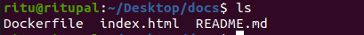
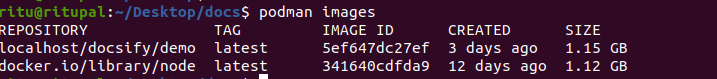
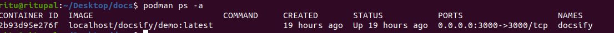
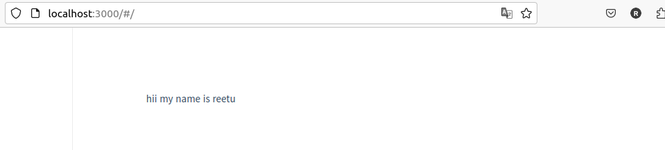
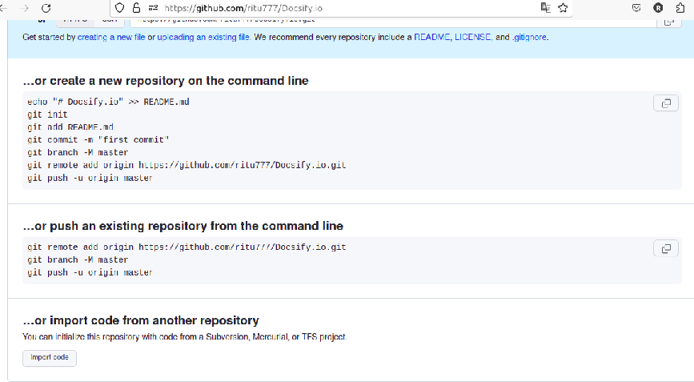
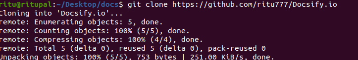
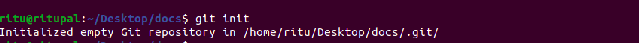
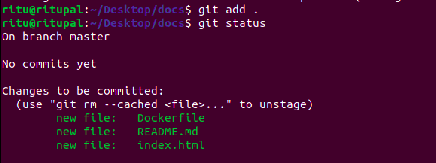
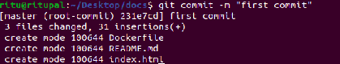
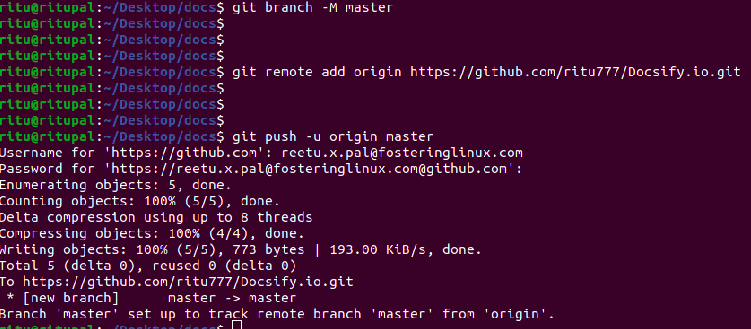

<u><h1 style="text-align:center">Docsify setup in podman and integrate with github</h1></u>


<h3> Requirement of docsify setup:</h3>
Docsify is a lightweight, flexible, and easy-to-set-up documentation generator that can turn your Markdown documentation into a website.


<h3> Linux distribution:</h3>


- Distributor ID:   Ubuntu
- Description:  Ubuntu 20.04.6 LTS
- Release:  20.04
- Codename: focal
 <h3>Prerequisites tools:</h3>


-  Podman
-  Github
  
<u>**Podman**</u>

Podman is a tool  that helps you run and manage software packages called containers on your computer.

<u>**Github**</u>

GitHub is an online software development platform. It's used for storing, tracking, and collaborating on software projects.

Now start a setup by following these steps:

<h2>Step-1:-<u> Install podman </h2></u>
 
First update and upgrade by using this
command :

```
sudo apt update
sudo apt upgrade
```

Then use podman installation command:

```
sudo apt install -y podman
```

- **sudo :** Superuser do

- **apt :** This stands for "Advanced Package Tool.
 apt is used to install, update, and manage software packages on your sysytem.

- **-y :** Automatically confirms the installation without asking for user input.
  
- **podman :** It is the name of the package you want to install.
  

<h2>Step-2:- <u>Create directory</h2></u>
 
```
mkdir docs
```

- **mkdir :** This command use for making a new directory
- **docs :** Name of new directory.
  
<h2> Step-3:- <u> Create Dockerfile</u></h2>

```
vim Dockerfile
```

- **vim :** Use for create and edit a file.

- **Dockerfile :** Name of file.

Add details in Dockerfile:

```
 FROM node:latest
  LABEL description="A demo Dockerfile for build Docsify."
  WORKDIR /docs
  RUN npm install -g docsify-cli@latest
  EXPOSE 3000/tcp
  ENTRYPOINT docsify serve .
```

<h2>Step-4:-<u>Create index.html</u></h2>

```
vim index.html
```

Add details in html file:

```
<!-- index.html -->

<!DOCTYPE html>
<html>
  <head>
    <meta http-equiv="X-UA-Compatible" content="IE=edge,chrome=1" />
    <meta name="viewport" content="width=device-width,initial-scale=1" />
    <meta charset="UTF-8" />
    <link
      rel="stylesheet"
      href="//cdn.jsdelivr.net/npm/docsify@4/themes/vue.css"
    />
  </head>
  <body>
    <div id="app"></div>
    <script>
      window.$docsify = {
        //...
      };
    </script>
    <script src="//cdn.jsdelivr.net/npm/docsify@4"></script>
  </body>
</html>
```

<h2>Step-5:-<u> Create  new file in md format</u></h2>

```
touch README.md
```

- **touch :** Use for creating new file.

Here we can check all files by using this command:

- **ls :** It is a Linux shell command that lists directory contents of files and directories.




<h2>Step-6:- <u>Build docker image</u></h2>

```
 podman build -f Dockerfile -t docsify/demo .
```

- **podman build :** Initiating the container image building process means starting the procedure to create a new container image. 

- **-f :** It stands for file.

- **Dockerfile :** It specifies the name of the Dockerfile that should be used for the container image build.

- **-t :** It stands for tag.

- **docsify :** This is the name for the image.

- **/ :** It uses for path separator in file and directory path.

- **demo :** This is the tag for the image.
  
  This command is used to manage container images in Podman.


  
<h2>Step-7:-<u>Run podman</u></h2>
Create a podman container for docsify.

```
   podman run -d -p 3000:3000 -v /home/ritu/Desktop/docs:/docs localhost/docsify/demo
 ```

  This command  will run a container based on the docsify/demo image.
 
-  **Podman run :** It is used to run a container from the docsify/demo image.
  
-  **-d (detach mode):** It allows the container to run in the background. It's useful for users who don't want to see the container's output in the terminal.
   
-   **-p (port forwarding):**  It enables port forwarding between the container and the host system.

- **-v :** It indicates volume mounted from your host's into the container
 
 ```
podman ps -a
```
This command is used to see all containers on your system, both running and stopped.



 
 <h2>Step-8:-<u> Preview Output</u></h2>

 

<h2><u>Github</u></h2>

 <h2>Step-1:-<u>Create repository</u> </h2>
 Make a new repository with  public account.


Give a name to new repository.


After entering the name, It will show like this:





<h2>Step-2:-<u>Clone the repository</u></h2>

``` 
git clone https://github.com/ritu777/Docsify.io
```

- **git clone :** It is the Git command used to create a copy of a Git repository. 
- **https://github.com/ritu777/Docsify.io :** It is the URL of the remote Git repository you want to clone. 

<h2>Step-3:-<u> Integrate with Github</u></h2>
By following these commands:

```
git init

git add .

git commit -m "first commit"

git branch -M master

git remote add origin https://github.com/ritu777/...p.git

git push -u origin master
```



- **git init :** This command is used to initialize a new git repository in a directory.



- **git add .:** Any modifications you've made to files, any new files you've created, or any file deletions you've performed within the current directory and its subdirectories will be staged and ready for the next commit.



**git commit -m "first commit"**

- **git commit :** This is the core Git command for creating a new commit.

- **-m :** It stands for message.

- **"first commit" :** This is the actual commit message you provide. It should be enclosed in double or single quotes. 




 **git branch -M master**

- **git branch :** This is the Git command for working with branches.

- **-M :** It stands for "move" or "rename", When used with git branch, it renames the current branch to the specified name.

-  **master :** It is the new name you're assigning to the current branch.

   **git remote add origin https://github.com/ritu777/...p.git**
 
-  **git remote add :** It is the Git command used to add a repository.
 
-  **origin :** It is the default name used by Git when you clone a repository.
 
-  **https://github.com/ritu777/...p.git -** It is the URL of the remote Git repository you want to add as a remote.

  **git push -u origin master**

- **git push :** It is the command for pushing your local changes to a remote repository. 

- **-u :** It stands for "set upstream", When we use -u with git push. 

  It establishes a tracking relationship between your local branch (in this case, "master") and the corresponding branch on the remote repository. 

- **origin :** Name of the remote repository. 

- **master :** It is the name of the local branch you want to push to the remote repository.


